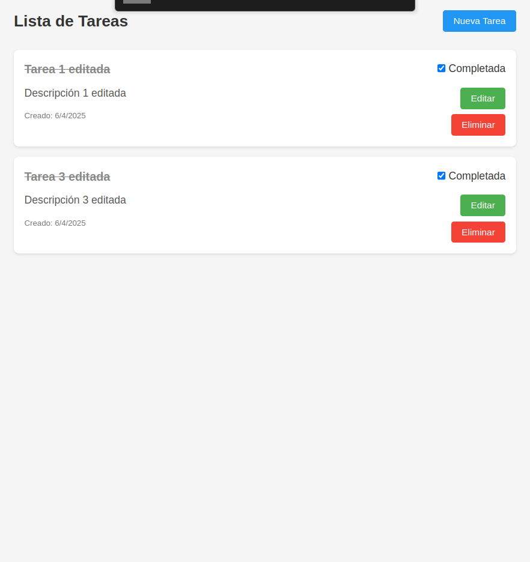

## Ejecución Local de la Aplicación

Sigue los pasos a continuación para configurar y ejecutar la aplicación localmente. Este proyecto está estructurado en dos partes principales: el **frontend** y el **backend**, cada uno ubicado en carpetas separadas dentro del repositorio.

### Prerrequisitos

Asegúrate de tener instalados los siguientes componentes en tu máquina:

- [Node.js](https://nodejs.org/) (versión 14 o superior)
- [npm](https://www.npmjs.com/) (incluido con Node.js)
- [Git](https://git-scm.com/)

### Pasos para la Configuración

1. **Clonar el repositorio**

    Clona este repositorio en tu máquina local utilizando el siguiente comando:

    ```bash
    git clone https://github.com/ema14bdt/academia-forit-2025.git
    ```

2. **Navegar al directorio del proyecto**

    Accede al directorio raíz del proyecto:

    ```bash
    cd academia-forit-2025
    ```

3. **Configurar el Backend**

    - Navega al directorio del backend:
      ```bash
      cd backend
      ```
    - Instala las dependencias necesarias:
      ```bash
      npm install
      ```
    - Inicia el servidor del backend:
      ```bash
      npm start
      ```
    - El backend estará disponible en `http://localhost:5000` (o el puerto configurado).

4. **Configurar el Frontend**

    - Abre una nueva terminal y navega al directorio del frontend:
      ```bash
      cd frontend
      ```
    - Instala las dependencias necesarias:
      ```bash
      npm install
      ```
    - Inicia el servidor del frontend:
      ```bash
      npm start
      ```
    - El frontend estará disponible en `http://localhost:5173` (o el puerto configurado).

### Acceso a la Aplicación

Para interactuar con la aplicación, abre tu navegador y accede al frontend en `http://localhost:5173`. Asegúrate de que el backend esté corriendo para que las funcionalidades estén disponibles.

### Notas Adicionales

- Asegúrate de que el backend esté corriendo antes de iniciar el frontend para evitar problemas de conexión.
- Si necesitas cambiar los puertos predeterminados, revisa los archivos de configuración en las carpetas `backend` y `frontend`.

Con estos pasos, deberías tener la aplicación completamente funcional en tu entorno local.

### Screenshots de la aplicación funcionando




